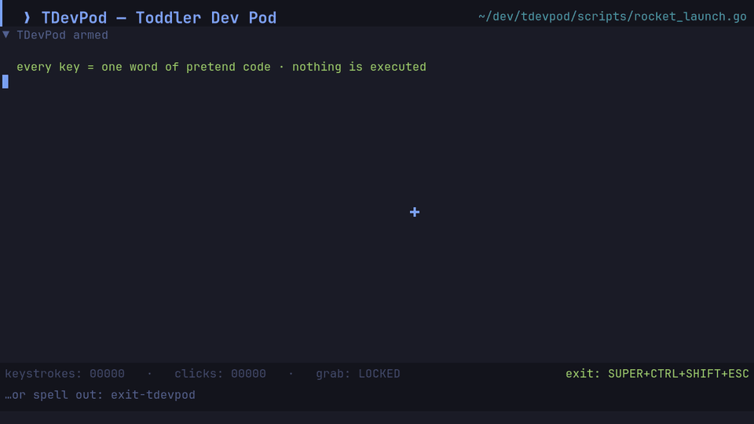

# TDevPod: Toddler Dev Pod



A fullscreen pretend terminal for omarchy/Hyprland that turns anything your
toddler does with the keyboard **or** mouse into a live, toy version of "typing
real code". All keystrokes and clicks are swallowed inside TDevPod —
the computer underneath is safely on timeout.

The "code" you see comes from the pretend scripts in [`scripts/`](scripts/):
Go, Bash, JavaScript, TypeScript, C, Rust, Ruby, Java, Kotlin, Haskell, Elixir,
Python, Lua and SQL, about rockets, dinosaurs, bubbles, trains and snacks. The
screen stays **quiet until the kid touches something**: every keystroke reveals
exactly one word of pretend code, every click pops a word plus a few sparks,
and when hands go quiet the screen goes quiet. Nothing auto-types over their
pecking. Consecutive progress-bar or spinner lines redraw **in place**, so
mashing through an "install" makes the bar fill up like a real one. The file
set is shuffled at each launch, and any files you drop into
`~/.config/tdevpod/scripts/` are played **instead** of the repo's scripts, so
no two sessions show the same code. **It is display-only. It is never parsed,
compiled, or executed by anything** — it lives in a drawing buffer and dies
when the pod closes.

## Files

| File               | Purpose                                            |
|--------------------|----------------------------------------------------|
| `tdevpod`          | launcher — engages the Hyprland lockdown + restores it |
| `tdevpod.py`       | the GTK fullscreen theatre (follows your omarchy theme) |
| `scripts/`         | the pretend code that gets "typed" (add your own!)  |
| `tools/record_demo.py` | re-renders `docs/demo.gif` offscreen             |

## Install

```sh
git clone https://github.com/frankdatank007/tdevpod.git ~/.local/share/tdevpod
~/.local/share/tdevpod/tdevpod install     # adds SUPER+J to ~/.config/hypr/bindings.lua
```

`install` backs up `bindings.lua` first and is safe to re-run. The binding
stores the absolute path of the clone, so re-run it if you move the folder.

## Use

* Launch: press **SUPER + J** (installed into
  `~/.config/hypr/bindings.lua` in a clearly marked `TDEVPOD MARKER` block).
* Exit (grown-ups): **SUPER + CTRL + SHIFT + ESC**
  — or just spell `exit-tdevpod` with the keyboard (the letters are heard
  even though the screen only ever shows fake code; no Enter needed).
* Emergency exit (great for solving "I locked myself out"): open a terminal
  and run `tdevpod unlock`.

While the pod is up, Hyprland drops into the `tdevpod` keymap **submap**,
so *no* Super shortcuts (workspaces, app launcher, screenshots, …) do anything.
The only active compositor binding is the unlock combo. Since the window is
fullscreen and focused, plain keys and clicks just feed the theatre.

## How the lockdown works (omarchy/Hyprland)

1. **`tdevpod`** (the wrapper) enters the `tdevpod` submap via
   `hyprctl dispatch 'hl.dsp.submap("tdevpod")'`. Inside a submap Hyprland
   only honors that submap's binds — the exit combo.
2. The GTK3 app opens fullscreen (native Wayland, XWayland untouched) and hides
   the real cursor in favour of its own. A best-effort Xlib grab also grabs the
   XWayland virtual root so stray X clients see nothing; the authoritative
   lockdown is the submap, because Hyprland only honors that submap's keys
   while it is active.
3. When the pod ends — no matter how — the wrapper resets the submap and runs
   `hyprctl reload` to hand the compositor back its normal bindings.

If the wrapper itself is killed (SIGKILL) mid-session, run `tdevpod unlock`
from any terminal; it restores everything.

## Changing things

* **Exit combo**: edit `EXIT_KEYS`/`is_exit_combo` in `tdevpod.py` and the
  matching `hl.bind("SUPER + CTRL + SHIFT + ESCAPE", …)` line in the
  `TDEVPOD MARKER` block of `~/.config/hypr/bindings.lua`, then
  `hyprctl reload`.
* **Theme**: the palette is loaded live from omarchy's active theme
  (`~/.local/state/omarchy/current/theme/colors.toml`), so switching themes —
  including light ones — restyles TDevPod automatically on the next launch.
  Every key maps directly (`background`, `muted`, `green`, …); keys a theme
  omits fall back to the built-in Tokyo Night values.
* **Drop-in scripts**: add files to the repo's `scripts/` folder, or put
  any text files in `~/.config/tdevpod/scripts/` and TDevPod plays those
  instead (the directory is created on first launch). Files are shuffled per launch and
  reshuffled again when the pool is exhausted. Good source material: your real
  dotfiles, an `/etc` file, READMEs — anything, since it's only ever drawn.
* **Progress bars & spinners**: any line starting with a bar like
  `[#####-----]` / `[████░░░░]`, or a spinner glyph (`▖▘▝▗`, `⠋⠙⠹…`) followed
  by a space, is "live": each keystroke replaces the previous live line
  instead of adding a new one. Write one line per frame (see
  `scripts/install_dinos.sh` and `scripts/rocket_launch.go`).
* **Demo GIF**: `python3 tools/record_demo.py` rebuilds `docs/demo.gif` with
  the real drawing code, offscreen (no lockdown). Needs `ffmpeg`.
* **Launcher key**: change `o.bind("SUPER + J", …)` in the same marker block.

## Feedback & contributing

Found a bug or have an idea? Open an [issue](https://github.com/frankdatank007/tdevpod/issues/new/choose).
New pretend scripts are the easiest way to contribute; see [CONTRIBUTING.md](CONTRIBUTING.md).

## Uninstall

Delete the `TDEVPOD MARKER` block from `~/.config/hypr/bindings.lua`, then:
`hyprctl reload`. Remove the `tdevpod` / `tdevpod.py` files.

## Requirements

* omarchy (Hyprland, luā config) — this machine
* `python3` + GTK3 bindings (`python-pyobject3-gtk` / `python-gobject`)
* JetBrainsMono Nerd Font (present by default); falls back to any mono font

## Notes

* The pod deliberately does **not** disable the power/monitor keys (media keys
  are handled by Hyprland, not the submap) — if that matters for your toddler,
  add the relevant `XF86*` keys to a second submap bind.
* The screen is a *latency toy*, not an animation: one word per key/click, no
  idle auto-typing. If a younger kid only bangs the keyboard, that's still
  exactly one word per smash — the pretend code simply advances slowly.
* Because it renders its own text, TDevPod never touches the real clipboard,
  does not open files, and makes no network calls.